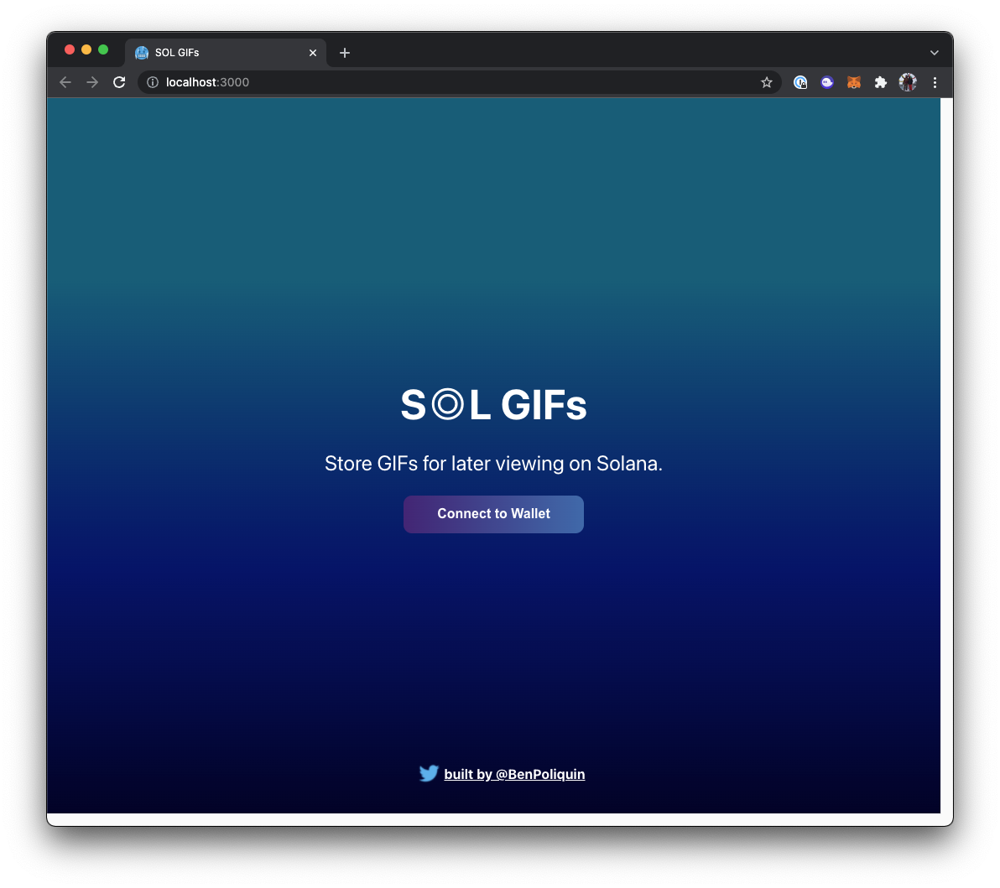

# SOL GIFs

#### Connect your Phantom wallet and post a GIF URL to save to Solana. 
##### Reads & Writes data to Solana.

### Run Locally
1. Run `npm install` at the root of your directory
2. Run `npm run start` to start the project locally

## Generate new BaseAccount to store data or clear current data 
```
cd src
node createKeyPair.js
```

# Copy IDL for program info every time `anchor deploy` is ran:
* `solana_program/target/idl/project_name.json`
* Copy this file to `src/idl.json`

# Deployment on the Solana Devnet
* https://explorer.solana.com/address/5LmeKrtHy5ZrSe9pzzx2JxzRpt6j6vQuie1ADT6VgbL9?cluster=devnet

## The program directory is where `anchor` commands should be run
```
anchor test
anchor build
anchor deploy
```
----------------------------------------------

<p align="middle">
  
   
  
</p>
